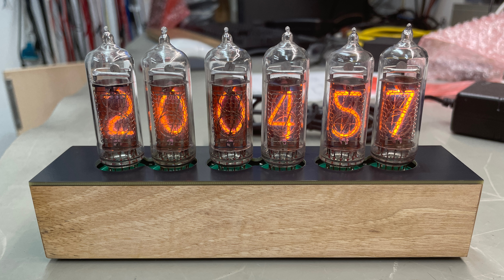
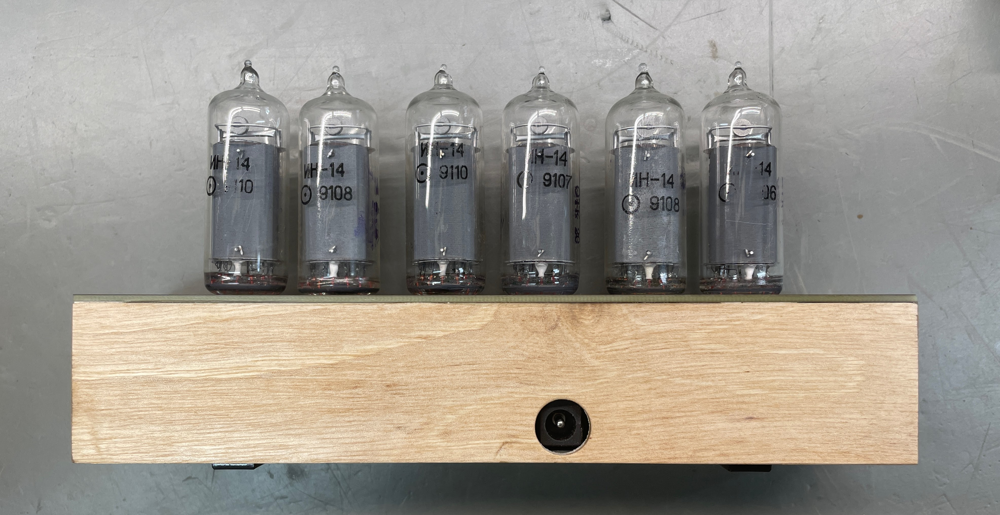
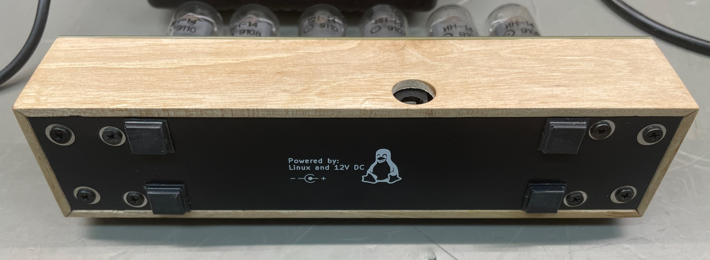

# About the Nixie Clock

This is a clock powered by a Raspberry Pi Zero W. It fetches current time by 
NTP and must be connected to a WiFi network to display the time.

The time is displayed on six IN-14 nixie tubes driven by six 74141. No 
multiplexing! The intensity can be adjusted by PWM.





## PCB's 
There are in total five PCB's in this project. All boards are drawn with KiCad 8.0.

### Board nixie-bottom
Bottom lid, no electrical function.

### Board nixie-clock
The main board, it hold gpio-expanders and driver IC's for the tubes. It
also connects to the PSU board, Raspberry Pi and the nixie tube board.

### Board nixie-clock-psu
Power supply board, creates 5V DC and 170V DC from 12V DC. The 170V is created by a step up converter build using a MAX1771 IC. The 5V is created by a integrated switched regulator.

### Board nixie-clock-tubes
Upper board on which all tubes are mounted.

### Board nixie-top
Top lid, no electrical function.

### Software
The clocks software is written in Python. It's just a simple poll loop that set the new time on gpio's on the gpio-expanders every time the second changes. It's started as a systemd service at boot time.

To install the software on the Raspberry Pi, copy the [./sw](sw/) folder to the Raspberry Pi and install the software by:

```
$ sudo ./clock-setup.sh
$ sudo reboot
```

NOTE: [./sw/timesyncd.conf](sw/timesyncd.conf) is an example.
